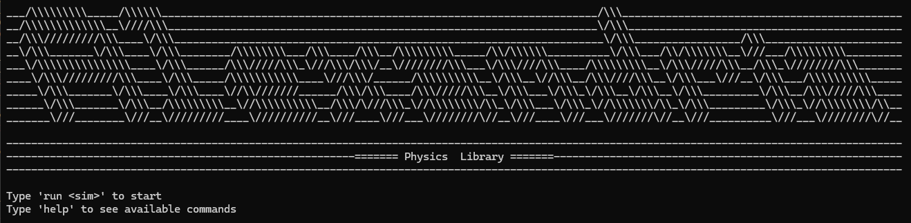

  
<strong>Alexandria is a OpenGL based software designed to calculate and visualize PDEs.</strong>

  
<strong>Above is an example of a visulation of the heat equation, run on Alexandria.</strong>

